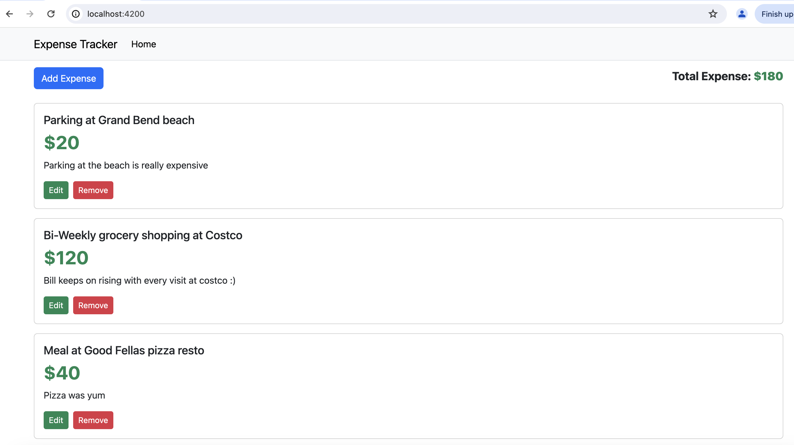
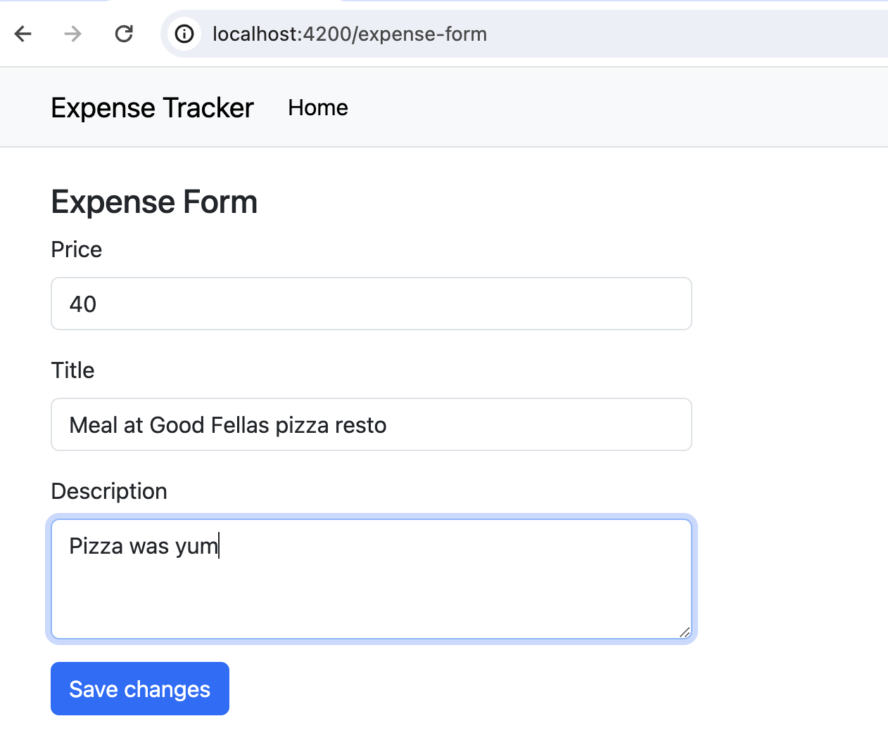

# ExpenseTracker

This is a simple expense tracker app built to practise Angular development.

It does not interact with any backend api or store the data in local storage. It stores the data within the app.

This project was generated with [Angular CLI](https://github.com/angular/angular-cli) version 17.0.3.

## To run in local
* checkout the repo and go to the project directory in terminal.
* Run `npm install` command.
* Run `ng serve` command. Navigate to `http://localhost:4200/`

## Screenshots
* Home page shows list of expenses and total expense

* Form to Add new expense or edit the existing expense
